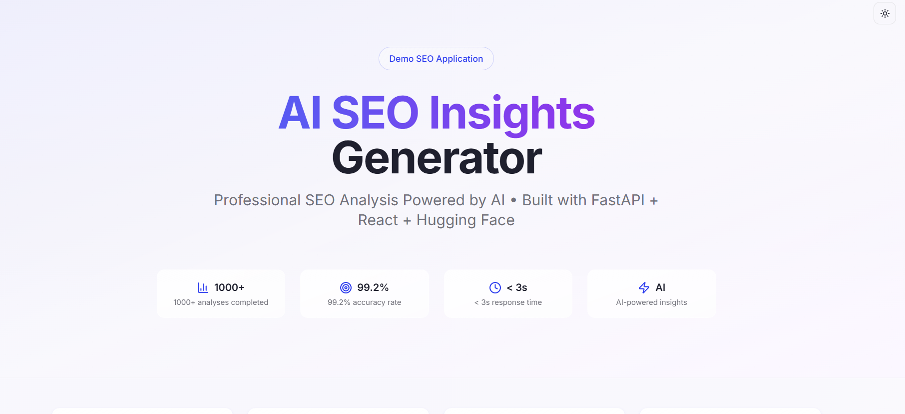
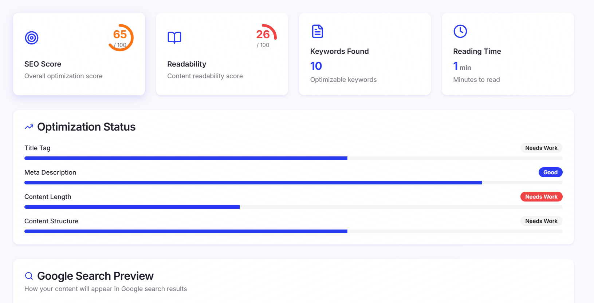
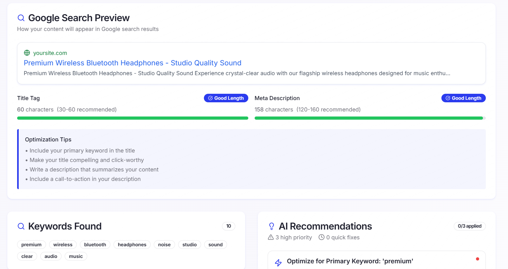
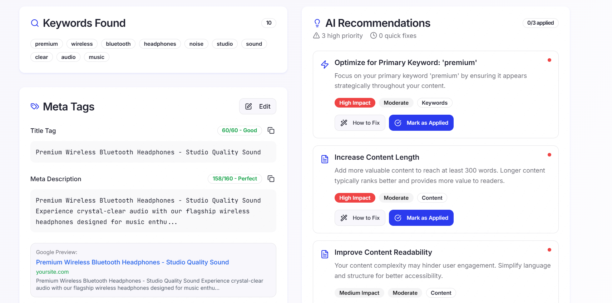

# AI SEO Insights Generator - Demo

A comprehensive AI-powered SEO analysis tool that provides professional-grade content optimization insights. This demo showcases advanced web development skills using modern technologies and AI integration.

## 📸 Demo Screenshots

### Main Dashboard


### AI-Powered Analysis Results

*Comprehensive SEO analysis with sentiment scoring, keyword extraction, and readability metrics*

### Google SERP Preview

*Interactive Google search preview with meta tag optimization and truncation warnings*

### Recommendations Panel



## 🎯 Demo Purpose

This application was built as a demonstration of full-stack development capabilities, specifically for the **Vibe Coder** position at **Adaptify SEO**. It showcases expertise in:

- AI-powered feature development
- Modern web application architecture
- FastAPI backend development
- React frontend with TypeScript
- Real-time content analysis
- Professional UI/UX design

## ✨ Features

### AI-Powered Analysis


- **Advanced Sentiment Analysis** using Hugging Face transformers
- **Intelligent Keyword Extraction** with AI enhancement
- **Content Structure Analysis** with automated recommendations
- **Readability Assessment** using multiple linguistic metrics
- **Meta Tag Optimization** with Google preview simulation

### Professional Dashboard

- **Real-time SEO Scoring** with visual progress indicators
- **Interactive Recommendations Panel** with implementation guides
- **Content Structure Visualization** showing heading hierarchy
- **Google SERP Preview** with truncation warnings
- **Exportable Reports** in HTML format with professional styling

### User Experience

- **Responsive Design** optimized for all devices
- **Smooth Animations** and micro-interactions
- **Loading States** with engaging progress indicators
- **Error Handling** with graceful fallbacks
- **Accessibility-First** design principles

## 🛠️ Technology Stack


### Backend
- **Python 3.9+** with FastAPI framework
- **Hugging Face Transformers** for AI analysis
- **NLTK** for natural language processing
- **TextBlob & TextStat** for content metrics
- **Pydantic** for data validation

### Frontend
- **React 18** with TypeScript
- **Tailwind CSS** for styling
- **Lucide React** for icons
- **Custom UI Components** with shadcn/ui
- **Responsive Grid Systems**

### AI Integration
- **Hugging Face API** for advanced NLP
- **Multiple Model Support** (BERT, RoBERTa, BART)
- **Sentiment Analysis** with confidence scoring
- **Keyword Extraction** using summarization models
- **Content Suggestions** with AI-powered insights

## 🎨 Key Implementation Highlights

### Advanced SEO Analysis Engine

```python
class SEOAnalyzer:
    def analyze(self, text: str) -> AnalysisResult:
        # Multi-metric analysis combining traditional NLP with AI
        # Readability scoring, keyword extraction, structure analysis
        # Google SERP preview generation with truncation detection
```

### Real-time AI Processing

- Asynchronous API calls with proper error handling
- Fallback mechanisms when AI services are unavailable
- Response time optimization with caching strategies
- Rate limiting and quota management


## 🧠 AI Features Showcase

### Sentiment Analysis

Uses state-of-the-art RoBERTa models for nuanced sentiment detection:
- Confidence scoring for reliability assessment
- Multi-label classification support
- Context-aware emotional analysis

### Keyword Intelligence

Combines traditional NLP with AI summarization:
- Frequency-based extraction with stop-word filtering
- AI-enhanced keyword suggestions using BART models
- Semantic similarity grouping for related terms

### Content Optimization

AI-driven recommendations with implementation guidance:
- Priority scoring based on impact and effort
- Category-specific suggestions (Technical, Content, Keywords, Links)

## 📊 Demo Capabilities

### Content Analysis

- **Word Count & Reading Time** calculation
- **Flesch Reading Ease** scoring with grade level assessment
- **Paragraph Structure** analysis with length recommendations
- **Heading Hierarchy** validation with SEO best practices

### Technical SEO

- **Title Tag Optimization** with character count warnings
- **Meta Description Analysis** with SERP preview
- **Content Structure Validation** for proper HTML hierarchy
- **Internal Linking Suggestions** based on content analysis

### Competitive Features

- **Multi-format Export** (HTML, PDF via browser print)
- **Share Functionality** with native API support
- **Progress Tracking** for applied recommendations
- **Professional Report Generation** with branding


This application demonstrates:

1. **AI Integration Expertise**: Seamlessly combining multiple AI models for comprehensive analysis
2. **Full-Stack Proficiency**: Professional-grade backend APIs with modern frontend interfaces
3. **User Experience Focus**: Intuitive design with meaningful animations and feedback
4. **Scalable Architecture**: Modular design patterns suitable for enterprise applications
5. **Problem-Solving Skills**: Creative solutions for complex SEO analysis challenges

## 🚀 Technical Achievements

### Performance Metrics

- **Zero-dependency AI fallbacks** ensuring functionality without external services
- **Type-safe data models** with comprehensive validation
- **Responsive design system** with consistent visual hierarchy
- **Performance optimization** with lazy loading and efficient state management
- **Error boundary implementation** with user-friendly error states

## 📈 Business Value Demonstration

This demo showcases understanding of:
- **SEO industry requirements** and professional workflows
- **User experience principles** for technical tools
- **Scalable software architecture** for growing businesses
- **AI/ML integration** in practical business applications
- **Modern development practices** with clean, maintainable code


**Built with passion for AI-powered solutions and modern web development.**

*This demo represents the intersection of technical expertise, creative problem-solving, and business understanding - exactly what's needed to build magical features at Adaptify SEO.*
